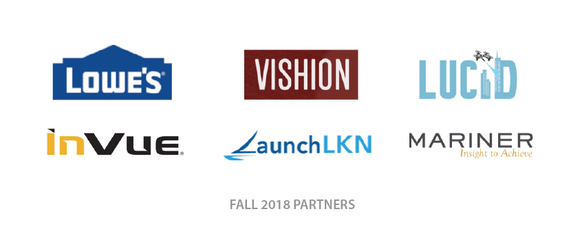

# UNCC Computer Vision Industry and Community Partnerships

## Why?
Cheap and ubiquitous cameras coupled with powerful algorithms are enabling an enormous number of new computer vision applications. In Computer Vision (ITCS 4152/5152) at UNCC, students learn to build these computer vision algorithms. Where things get really exciting is when students can use these algorithms to **solve real problems.** 

## What?
The partnership program connects groups of students in ITCS 4152/5152 (typically groups of 4, 3 grad students, 1 undergrad) with local partners. Partners provide a problem of interest, and meet with teams 3 times over the course of the semester to provide guidance and direction over the course of the semester. 

## Who?

## Expectations

### Benefits to Industry Partners
- Terrific way to identify well-qualified interns or hires
- Learn how cutting-edge deep learning techniques apply to your specific problem

### Benefits to Students
- Get work on a real problem
- A little guidance along the way
- Exposure to interesting places to potentially work
- Strong incentive to actually get stuff done

### Disclaimers
- In the unlikely case than novel IP is developed in the course of the project, ownership defaults to UNCC. Specific IP agreements maybe feasible under certain circumstances. 

## When?

### Meeting 1: Topic Selection (September)
- Industry Partners will choose 1-3 interesting problems for teams to potentially work on.
- Meeting location + times will be coordinated between teams and partners
- Topic should be nailed down by the end of September

### Meeting 2: Midway Update (October)
- Teams will present a review of relevant academic literature, publically available data, tools, and code; and existing industry solutions. Findings will be shared in a short slide deck and short write up.

### Meeting 3: Final Presentation (December)
- Between Dec 1 and Dec 6
- Industry Partners are invited to attend final group presentations at UNCC. If the timing doesn't work, teams will present twice - once at UNCC final groups presentations, and meet with partners independently for final presentations.
- Teams will share a demo of the solution they have developed, and share key findings form the development process. 
